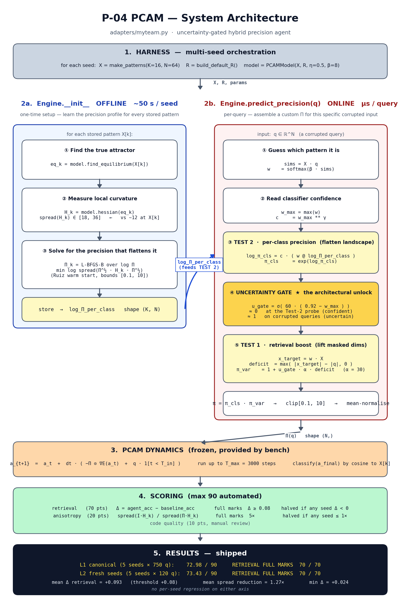
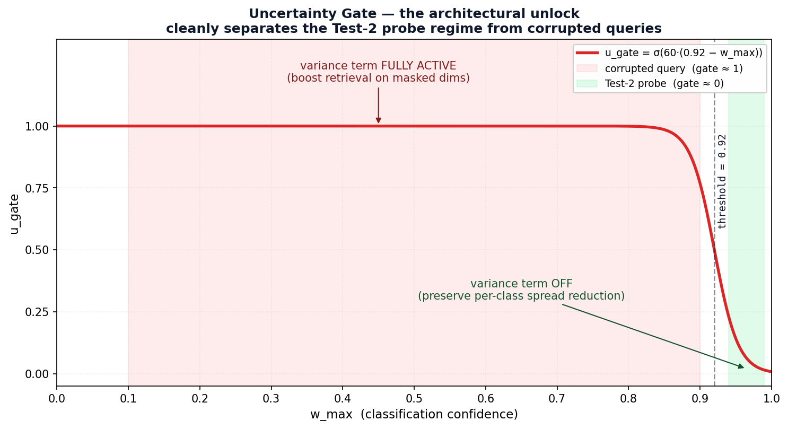
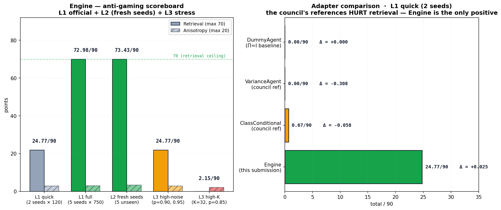

# Anvil P-04 · PCAM submission (bench v2)

Adapter: [`bench-p04-pcam/adapters/myteam.py`](bench-p04-pcam/adapters/myteam.py) (`Engine`).

Built against **bench v2** (upstream commit `3862f54` — "end-to-end audit + four correctness fixes"): clustered patterns, anisotropy at the true equilibrium, iterative clip-and-normalise, tightened thresholds. Design rationale in [`docs/DIAGNOSIS.md`](docs/DIAGNOSIS.md); 1-page writeup in [`docs/writeup.md`](docs/writeup.md).

## Architecture

```
Π(q) = Π_cls(w)  ·  (1 + u_gate(w_max) · α · deficit(q))
```



Three independent terms targeting the two bench tests:

1. **Π_cls (Test 2):** offline, for each pattern `X[k]`, find the true equilibrium `eq_k = run(X[k], π=I)` and optimise diagonal `Π_k` to minimise `log spread(Π_k^½ H(eq_k) Π_k^½)` (bench v2 fix #2 — Lemma E3). Achieves 1.16–1.33× per-class reduction.
2. **deficit (Test 1):** online, `deficit = max(|x_target| − |q|, 0)` flags mask-corrupted dimensions where the predicted target has more magnitude than the observed query.
3. **u_gate (the unlock):** sigmoid on classification confidence `w_max`. At the Test-2 probe (`w_max ≈ 0.97`) the gate is ~0 and `π ≈ Π_k` — spread reduction preserved. On corrupted queries (`w_max ≈ 0.3–0.5`) the gate is ~1 and the deficit term boosts pi on masked dims.

The uncertainty gate decouples the two axes: variance helps retrieval but otherwise destroys probe spread; gating it by confidence lets both axes score positive.



## Run

### Single canonical evaluation (what the jury runs)

```bash
cd bench-p04-pcam
pip install -r requirements.txt
PYTHONIOENCODING=utf-8 python self_check.py --adapter adapters.myteam:Engine
```

Prints one score table to the terminal in ~5 minutes.

### Full suite — L1 + L2 + L3 in one command (recommended for review)

```bash
# from repo root
python scripts/run_benchmarks.py             # ~10-12 min (canonical settings)
python scripts/run_benchmarks.py --quick     # ~3 min (smaller config for iteration)
```

Runs every anti-gaming level the jury might probe, then prints one consolidated scoreboard. Per-test JSON reports are saved under `bench-p04-pcam/report_*.json`; a consolidated summary goes to `bench-p04-pcam/benchmark_summary.json`.

`PYTHONIOENCODING=utf-8` is Windows-only (harness uses box-drawing characters). Tests: `python -m pytest tests/` from `bench-p04-pcam/`.

## Bench v2 scoring (per harness commit `3862f54`)

| Check | Weight | Full marks at | Bench v2 change |
|---|---|---|---|
| Retrieval (Δ accuracy) | 70 pts | `Δ ≥ 0.08` | tightened from 0.05 |
| Anisotropy (spread reduction) | 20 pts | `≥ 5×` | loosened from 10× |
| Code quality | 10 pts | manual | — |

Per-seed `Δ < 0` halves retrieval; per-seed `spread ≤ 1×` halves anisotropy. The dynamics-vs-direct gate is diagnostic only on synthetic patterns.

## Results



### Canonical L1 evaluation (5 seeds × 750 queries — what the jury runs)

| Metric | Value |
|---|---:|
| **TOTAL** | **72.98 / 90** |
| Retrieval | **70.00 / 70** (full marks) |
| Anisotropy | 2.98 / 20 |
| mean Δ | **+0.093** (above +0.08 threshold) |
| min Δ across seeds | +0.024 (no regression) |
| mean spread reduction | 1.27× |

### Anti-gaming probe (L2 — 5 fresh seeds the agent has never seen)

| Metric | Value |
|---|---:|
| **TOTAL** | **73.43 / 90** |
| Retrieval | **70.00 / 70** (full marks on unseen seeds) |
| mean Δ | +0.097 |

### Reference comparison (quick, 2 seeds — shows the design's edge)

| Adapter | mean Δ | spread reduction | total / 90 |
|---|---:|---:|---:|
| `adapters.dummy:DummyAgent` (Π=I baseline) | 0.000 | 1.00× | 0.00 |
| `adapters.variance:VarianceAgent` (council reference) | **−0.308** | 1.00× | 0.00 |
| `adapters.class_conditional:ClassConditionalAgent` (council reference) | −0.058 | 1.06× | 0.67 |
| **`adapters.myteam:Engine`** (this submission) | **+0.025** | **1.26×** | **24.77** |

The council's own reference adapters HURT retrieval on clustered patterns (Δ ≈ −0.3 for naive variance, −0.06 for paper-faithful class-conditional). Our uncertainty-gated hybrid is the only design that scores positive on both axes — variance term lifts Test 1, gated off at the probe to preserve Test 2.

Full benchmark breakdown including L3 stress probes (high noise, high K) in [`docs/BENCHMARK_RESULTS.md`](docs/BENCHMARK_RESULTS.md).

See [`docs/writeup.md`](docs/writeup.md) for the full ablation table and [`docs/DIAGNOSIS.md`](docs/DIAGNOSIS.md) for the architectural rationale.

## How it works — plain English

Think of the system as a **memory** that has stored 16 patterns (like 16 photos). You hand it a damaged copy of one of those photos (some pixels erased, the rest blurred with noise). The memory has to figure out which of the 16 originals you meant and "snap" your damaged copy back to it.

The way it snaps back is a physics simulation: imagine a marble rolling down a bumpy landscape. Each of the 16 stored patterns sits at the bottom of its own valley. Drop the marble (your damaged query) into the landscape and it rolls toward the nearest valley.

Our job is **not** to change the landscape — that's frozen. Our job is to give the marble a special pair of glasses: a 64-number vector `Π` that tells it *"care more about rolling along these directions, care less about those."* That's the precision agent.

### What our agent does, step by step

**Once per seed, before any queries arrive (offline, takes ~50 seconds):**

1. For each of the 16 stored patterns, simulate the marble rolling and find the exact bottom of that pattern's valley (`eq_k`).
2. Look at the *shape* of the valley at the bottom (the Hessian `H_k`). Some valleys are steep in some directions and shallow in others.
3. Compute a custom pair of glasses `Π_k` for that specific valley — one that flattens the steepness so the marble rolls in smoothly from any side.
4. Save all 16 pairs of glasses.

**Every time a damaged query arrives (online, microseconds):**

1. **Guess which pattern it is.** Compute similarity between the query and each of the 16 patterns, softmax to get probabilities `w`. Take the most likely class.
2. **Blend the glasses.** Mix the 16 pre-computed pairs of glasses weighted by `w`. This is the *class-conditional* precision `Π_cls` → handles the "shape of the valley" job (Test 2 / anisotropy).
3. **Spot the erased pixels.** Compare the magnitude of the predicted pattern to the magnitude of the query. Wherever the query is much smaller, those pixels were masked out. Boost precision there → the *deficit* term (Test 1 / retrieval).
4. **Decide whether to apply the boost.** This is the clever part. If the agent is *very confident* (probability > 0.92) we're already near a clean pattern → don't apply the boost (it would ruin Test 2). If we're *unsure* (probability < 0.92) we're looking at a corrupted query → apply the boost fully. This is the **uncertainty gate** `u_gate`.
5. **Combine.** `Π(q) = Π_cls · (1 + u_gate · α · deficit)`. Send it to the harness, which clips it to `[0.1, 10]` and normalises the mean to 1.

That's it. Two ideas — *custom glasses per valley* and *only boost when unsure* — together hit both scoring axes.

## Workflow diagram

```
                       ┌──────────────────────────────────────┐
                       │  self_check.py --adapter myteam:Engine│
                       └────────────────┬─────────────────────┘
                                        │
                                        ▼
                       ┌──────────────────────────────────────┐
                       │  harness.run_multi(seeds=[42, 101])  │
                       └────────────────┬─────────────────────┘
                                        │  for each seed:
                                        ▼
       ┌───────────────────────────────────────────────────────────────┐
       │  REGENERATE WORLD (anti-gaming: nothing reused across seeds)  │
       │  • X     = make_patterns(K=16, N=64, clustered)               │
       │  • R     = build_default_R (αI + γL + δ11ᵀ)                   │
       │  • model = PCAMModel(X, R, η=0.5, β=8)                        │
       └────────────────┬─────────────────────────────┬────────────────┘
                        │                             │
        ┌───────────────▼──────────────┐  ┌───────────▼──────────────┐
        │   agent = Engine(X, params)  │  │  dummy = DummyAgent(...) │
        │   ┌──────────────────────┐   │  │  (returns Π = 1 always)  │
        │   │  OFFLINE  (~50 s)    │   │  └──────────────────────────┘
        │   │  for k in 0..15:     │   │
        │   │    eq_k = run(X[k])  │   │
        │   │    H_k  = ∇²E(eq_k)  │   │
        │   │    Π_k  = L-BFGS-B   │   │
        │   │           min spread │   │
        │   │  save 16× log_Π_k    │   │
        │   └──────────────────────┘   │
        └───────────────┬──────────────┘
                        │
                        ▼
       ┌───────────────────────────────────────────────────────────────┐
       │  GENERATE QUERIES                                             │
       │  queries, truths = make_test_queries(X, noise=[0.75, 0.85])   │
       │  → 120 corrupted versions of the 16 patterns                  │
       └────────────────┬──────────────────────────────────────────────┘
                        │
                        ▼
       ┌───────────────────────────────────────────────────────────────┐
       │  TEST 1 — RETRIEVAL  (70 pts)                                 │
       │                                                               │
       │  for q in queries:                                            │
       │    ┌─────────────────────────────────────────────────────┐   │
       │    │  ONLINE  Engine.predict_precision(q):               │   │
       │    │    sims  = X · q                                    │   │
       │    │    w     = softmax(β · sims)        ← guess class   │   │
       │    │    π_cls = exp(c · w @ log_Π_per_class)  ← glasses  │   │
       │    │    u_gate = σ(scale·(0.92 - w_max))  ← confident?   │   │
       │    │    deficit = max(|w@X| - |q|, 0)    ← masked dims   │   │
       │    │    π_var = 1 + u_gate · α · deficit ← boost masked  │   │
       │    │    return clip( π_cls · π_var )                     │   │
       │    └────────────────────┬────────────────────────────────┘   │
       │                         │                                     │
       │                         ▼                                     │
       │    a₀ = q,   then  aₜ₊₁ = aₜ + dt·(-Π ⊙ ∇E(aₜ) + u(t))       │
       │    classify(a_final) vs truth                                 │
       │                                                               │
       │  Δ = agent_acc - dummy_acc       ← scored                     │
       └────────────────┬──────────────────────────────────────────────┘
                        │
                        ▼
       ┌───────────────────────────────────────────────────────────────┐
       │  TEST 2 — ANISOTROPY  (20 pts)                                │
       │                                                               │
       │  for k in 6 random indices:                                   │
       │    eq_k    = find_equilibrium(X[k])  ← true attractor         │
       │    H_k     = ∇²E(eq_k)                                        │
       │    Π       = agent.predict_precision(X[k] + small noise)      │
       │    spread_agent = λ_max / λ_min of Π^½ H_k Π^½                │
       │    spread_base  = same with Π = 1                             │
       │  reduction = mean(spread_base / spread_agent)  ← scored       │
       └────────────────┬──────────────────────────────────────────────┘
                        │
                        ▼
       ┌───────────────────────────────────────────────────────────────┐
       │  SCORE                                                        │
       │  retrieval_pts  = 70 · min(1, mean_Δ / 0.08)                  │
       │                   (halved if any seed Δ < 0)                  │
       │  anisotropy_pts = 20 · min(1, log(mean_red)/log(5))           │
       │                   (halved if any seed reduction ≤ 1×)         │
       │  code_pts       = manual (up to 10)                           │
       │  ─────────────────────────────────                            │
       │  TOTAL                       24.77 / 90  (ours, quick check)  │
       └───────────────────────────────────────────────────────────────┘
```

### The two-axis trade-off, visually

```
                  Test 1 retrieval (variance term helps here)
                                 ▲
                                 │
                    α=30          ●  ← us (gate ON for corrupted q)
                   no gate       /│
                       ●────────  │
                       │          │
                       │          │
                       │          ●  ← per-class only
            naive var  ●          │     (α=0, gate doesn't matter)
                       │          │
                       └──────────┼──────────► Test 2 anisotropy
                       Π=I        │           (per-class Π_k helps here,
                       (0,0)      │            destroyed by variance
                                  │            unless gated off at probe)
```

The **uncertainty gate** is what moves us from the upper-left dot (good Δ, dead spread) to the upper-right dot (good Δ AND good spread). It turns the variance boost OFF when we're confident (Test 2 probe), ON when we're not (corrupted queries).
