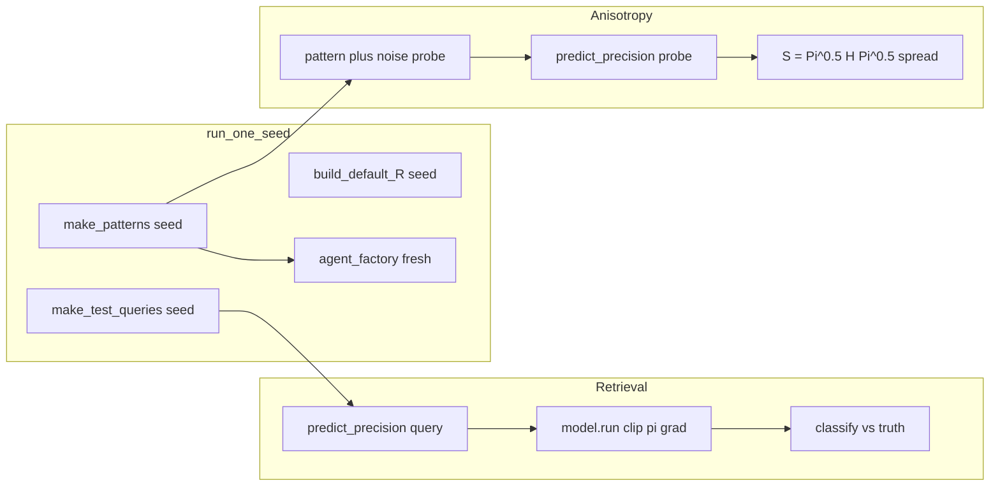

# P-04 Bench Notes (`bench-p04-pcam`)

Reference answers for the frozen PCAM harness. All citations are from `bench-p04-pcam/` only.

---

## 1. Where is the energy function E(x) defined?

There is **no** runtime `energy()` (or `E()`) function in the codebase. `E(a)` is stated only in the module docstring of `pcam_model.py`:

```8:11:bench-p04-pcam/pcam_model.py
Energy:   E(a) = 1/2 a^T R a  -  (eta/beta) log sum_i exp(beta x_i^T a)
Gradient: grad E(a) = R a  -  eta X^T softmax(beta X a)
Dynamics: a_{t+1} = a_t + dt * ( -pi * grad E(a_t)  +  J * u(t) )
Hessian:  H(a) = R  -  eta * beta * X^T (diag(s) - s s^T) X     where s = softmax(beta X a)
```

The gradient used in dynamics is implemented as:

```73:75:bench-p04-pcam/pcam_model.py
    def gradient(self, a: np.ndarray) -> np.ndarray:
        s = self._softmax(a)
        return self.R @ a - self.eta * (self.X.T @ s)
```

**Mathematical form (one sentence):**  
\(E(a)=\tfrac12 a^\top R a - \tfrac{\eta}{\beta}\log\sum_i e^{\beta x_i^\top a}\) — a quadratic regularizer in \(a\) minus a log-sum-exp coupling to the stored patterns through softmax similarities \(\beta x_i^\top a\).

---

## 2. Where is the descent dynamics step? Where is Π multiplied?

**Descent step** lives in `PCAMModel.run()`:

```100:111:bench-p04-pcam/pcam_model.py
        pi = self.clip_and_normalise(pi)
        a = np.asarray(a0, dtype=np.float64).copy()
        for t in range(self.T_max):
            g = self.gradient(a)
            update = -pi * g
            if u_const is not None and t < self.T_in:
                update = update + u_const
            a_new = a + self.dt * update
            if np.linalg.norm(a_new - a) < self.tol:
                a = a_new
                break
            a = a_new
```

The docstring at the top of the same file states the update rule explicitly:

```10:10:bench-p04-pcam/pcam_model.py
Dynamics: a_{t+1} = a_t + dt * ( -pi * grad E(a_t)  +  J * u(t) )
```

**Where Π is applied:** Π is multiplied **element-wise into the gradient** (`update = -pi * g`). It is **not** applied inside the softmax (softmax is computed inside `gradient()` via `_softmax()`), not into state norm, and not as a separate left/right factor on \(R\) alone.

External input `u_const` is added to `update` only while `t < T_in` (lines 105–106).

---

## 3. Test 1 scoring — retrieval accuracy, Δ, and negative-Δ penalty

### Per-query check (primitive)

```11:21:bench-p04-pcam/checks.py
def retrieval_accuracy(model: PCAMModel,
                       agent,
                       queries: np.ndarray,
                       truths: np.ndarray) -> float:
    correct = 0
    for q, t in zip(queries, truths):
        pi = agent.predict_precision(q)
        a_star = model.run(q, pi, u_const=q)
        if model.classify(a_star) == int(t):
            correct += 1
    return correct / len(queries)
```

### Per-seed Δ

```88:100:bench-p04-pcam/harness.py
    base_acc = retrieval_accuracy(model, dummy, queries, truths)
    agent_acc = retrieval_accuracy(model, agent, queries, truths)

    rng = np.random.default_rng(seed)
    indices = rng.choice(K, size=min(n_aniso, K), replace=False).tolist()
    spread = spread_reduction(model, agent, dummy, indices, seed=seed)
    dur = time.monotonic() - t0

    return SeedReport(
        seed=seed,
        agent_accuracy=float(agent_acc),
        baseline_accuracy=float(base_acc),
        delta=float(agent_acc - base_acc),
```

Baseline is `DummyAgent`, which returns Π = 1 everywhere:

```22:23:bench-p04-pcam/adapters/dummy.py
    def predict_precision(self, corrupted_query: np.ndarray) -> np.ndarray:
        return np.ones(self.N)
```

### Aggregation across seeds

```108:116:bench-p04-pcam/harness.py
def aggregate(seed_reports: list[SeedReport]) -> Aggregated:
    deltas = [r.delta for r in seed_reports]
    spreads = [r.spread_reduction for r in seed_reports]
    return Aggregated(
        mean_delta=float(np.mean(deltas)),
        min_delta=float(np.min(deltas)),
        mean_spread=float(np.mean(spreads)),
        min_spread=float(np.min(spreads)),
        seeds=[r.seed for r in seed_reports],
    )
```

### Automated scoring (retrieval points)

```120:131:bench-p04-pcam/harness.py
def retrieval_points(mean_delta: float,
                     min_delta: float,
                     full_at: float = 0.05,
                     weight: float = WEIGHTS["retrieval"]) -> float:
    """Score retrieval. Penalises agents that regress on any seed."""
    if mean_delta <= 0:
        return 0.0
    base = min(weight, weight * (mean_delta / full_at))
    # Per-seed sanity gate: any regression below baseline halves the points.
    if min_delta < 0:
        base *= 0.5
    return float(base)
```

**Δ accuracy (mathematical):**  
Per seed, \(\Delta = \mathrm{acc}_{\mathrm{agent}} - \mathrm{acc}_{\mathrm{baseline}}\), where each accuracy is the fraction of test queries correctly classified after integrating dynamics with the agent’s (or dummy’s) precision. Across seeds, `mean_delta` and `min_delta` are the arithmetic mean and minimum of those per-seed Δ values.

**Penalty for negative Δ on a seed:**  
Scoring does **not** zero out individual seeds. If **any** seed has \(\Delta < 0\), then `min_delta < 0` and the **entire** retrieval score is multiplied by **0.5** (`base *= 0.5`). Separately, if `mean_delta <= 0`, retrieval points are **0** regardless of per-seed spread.

The README states the same gate in prose:

```76:77:bench-p04-pcam/README.md
- **Any seed with Δ < 0** (agent regresses below Π=I on that seed) halves the retrieval score.
- **Any seed with spread reduction ≤ 1.0×** halves the anisotropy score.
```

---

## 4. Test 2 scoring — anisotropy spread

### Spread at one pattern

```24:40:bench-p04-pcam/checks.py
def per_pattern_spread(model: PCAMModel, pi: np.ndarray, pattern: np.ndarray) -> float | None:
    """Spread mu_max / mu_min of the symmetrised contraction operator at the
    given (approximate) equilibrium, under precision pi."""
    pi = model.clip_and_normalise(pi)
    H = model.hessian(pattern)
    H = 0.5 * (H + H.T)
    eig_H = np.linalg.eigvalsh(H)
    if eig_H.min() <= 0:
        return None  # not in a stable basin under PCAM assumptions
    pi_sqrt = np.sqrt(pi)
    S = (pi_sqrt[:, None] * H) * pi_sqrt[None, :]
    S = 0.5 * (S + S.T)
    eigs = np.linalg.eigvalsh(S)
    eigs = eigs[eigs > 1e-9]
    if len(eigs) < 2:
        return None
    return float(eigs.max() / eigs.min())
```

**Symmetric matrix:** After symmetrizing the Hessian \(H\) at the (approximate) equilibrium `pattern`, the code forms

\[
S = \Pi^{1/2}\, H\, \Pi^{1/2}
\]

(with diagonal Π), symmetrizes \(S\) again, and measures the eigenvalue ratio \(\lambda_{\max}/\lambda_{\min}\) on positive eigenvalues.

### Adapter input used to obtain Π

```53:60:bench-p04-pcam/checks.py
    for idx in pattern_indices:
        pattern = model.X[idx]
        probe = pattern + rng.standard_normal(model.N) * probe_sigma
        n = np.linalg.norm(probe)
        if n > 1e-12:
            probe = probe / n
        pi = agent.predict_precision(probe)
        s = per_pattern_spread(model, pi, pattern)
```

**Input to the adapter:** a **unit-norm probe** — stored pattern `model.X[idx]` plus Gaussian noise with `probe_sigma=0.05` (default), **not** the raw corruption used in Test 1. Spread is evaluated with `hessian(pattern)` at the stored pattern index, not at `probe`.

### Per-seed reduction factor and scoring

```66:78:bench-p04-pcam/checks.py
def spread_reduction(model: PCAMModel,
                     agent,
                     baseline,
                     pattern_indices: list[int],
                     seed: int = 0) -> dict[str, float]:
    base = anisotropy_spread(model, baseline, pattern_indices, seed=seed)
    yours = anisotropy_spread(model, agent, pattern_indices, seed=seed)
    factor = base / yours if yours > 0 and np.isfinite(yours) else 0.0
    return {
        "baseline_spread": round(base, 4),
        "agent_spread":    round(yours, 4),
        "reduction_factor": round(factor, 4),
    }
```

Harness stores `spread_reduction` as `spread_reduction` on each seed report (lines 91–103 in `harness.py`).

**Anisotropy points:**

```134:144:bench-p04-pcam/harness.py
def anisotropy_points(mean_spread: float,
                      min_spread: float,
                      full_at: float = 10.0,
                      weight: float = WEIGHTS["anisotropy"]) -> float:
    if mean_spread <= 1.0:
        return 0.0
    base = min(weight, weight * (np.log(mean_spread) / np.log(full_at)))
    # If any seed produced spread <= 1 (no improvement), penalise.
    if min_spread <= 1.0:
        base *= 0.5
    return float(base)
```

Here `mean_spread` / `min_spread` refer to the **reduction factor** (`baseline_spread / agent_spread`), aggregated across seeds like Test 1.

---

## 5. Adapter base class — required methods and signatures

```16:34:bench-p04-pcam/adapter.py
class Adapter(ABC):
    @abstractmethod
    def __init__(self,
                 stored_patterns: np.ndarray,
                 model_params: dict[str, Any]) -> None:
        """
        stored_patterns : ndarray (K, N) — the K patterns already in the system
        model_params    : dict with frozen system parameters
                          (R, eta, beta, dt, T_max, tol, pi_min, pi_max)
        """

    @abstractmethod
    def predict_precision(self, corrupted_query: np.ndarray) -> np.ndarray:
        """
        corrupted_query : ndarray (N,) — the noisy input
        returns         : ndarray (N,) of positive values, your precision weights.
                          Will be clipped to [pi_min, pi_max] and mean-normalised
                          by the harness before being applied.
        """
```

| Method | Exact signature |
|--------|-----------------|
| `__init__` | `(self, stored_patterns: np.ndarray, model_params: dict[str, Any]) -> None` |
| `predict_precision` | `(self, corrupted_query: np.ndarray) -> np.ndarray` |

Both are abstract. The harness expects a length-`N` vector of **positive** values; clipping and mean-normalization happen inside `PCAMModel` before dynamics.

---

## 6. Seed regeneration — what changes across seeds?

Each seed is evaluated in `run_one_seed()` with a **fresh** world:

```76:85:bench-p04-pcam/harness.py
    """Build a fresh model, agent, and query set for this seed."""
    X = make_patterns(K=K, N=N, seed=seed)
    R = build_default_R(N=N, seed=seed)
    model = PCAMModel(X, R)
    params = pack_params(model)

    agent = agent_factory(X, params)
    dummy = DummyAgent(X, params)

    queries, truths, _ = make_test_queries(X, noise_levels, n_per_level, seed=seed)
```

`run_multi()` loops over the seed list and calls `run_one_seed` for each:

```167:169:bench-p04-pcam/harness.py
    per_seed = [
        run_one_seed(agent_factory, s, K, N, noise_levels, n_per_level, n_aniso)
        for s in seeds
```

| Quantity | Changes with `seed`? | Mechanism |
|----------|----------------------|-----------|
| Stored patterns `X` | **Yes** | `make_patterns(K, N, seed=seed)` |
| Operator `R` | **Yes** | `build_default_R(N, seed=seed)` |
| Test queries / truths | **Yes** | `make_test_queries(..., seed=seed)` |
| Anisotropy pattern indices | **Yes** | `rng = np.random.default_rng(seed); rng.choice(K, ...)` |
| Probe noise in spread check | **Yes** | `anisotropy_spread(..., seed=seed)` |
| Adapter instance | **Yes** (new object) | `agent_factory(X, params)` per seed |
| `K`, `N` | **No** (fixed per run) | Arguments to `run_multi` / `run_one_seed` |
| `noise_levels`, `n_per_level`, `n_aniso` | **No** (fixed per run) | Same |

Pattern construction uses a fixed `twin_sigma=0.35` hyperparameter; only the **random draws** change with `seed`:

```15:18:bench-p04-pcam/data.py
def make_patterns(K: int = 16,
                  N: int = 64,
                  seed: int = 42,
                  twin_sigma: float = 0.35) -> np.ndarray:
```

---

## 7. Clip and normalise order on Π from `predict_precision`

Implemented in `clip_and_normalise()`:

```82:88:bench-p04-pcam/pcam_model.py
    def clip_and_normalise(self, pi: np.ndarray) -> np.ndarray:
        pi = np.asarray(pi, dtype=np.float64).reshape(self.N)
        pi = np.clip(pi, self.pi_min, self.pi_max)
        mean = pi.mean()
        if mean > 0:
            pi = pi / mean
        return pi
```

**Order:** (1) cast to `float64` and reshape to `(N,)`, (2) **clip** to `[pi_min, pi_max]`, (3) **divide by the mean** (if mean > 0).

**Call sites before dynamics / Hessian spread:**

- Every `run()` — line 100 applies it to adapter output before integrating.
- `per_pattern_spread()` — line 27 applies it again before building \(S\).

Default bounds are `pi_min=0.1`, `pi_max=10.0` (`PCAMModel.__init__` lines 53–54). README:

```129:129:bench-p04-pcam/README.md
- Precision is **diagonal and positive**. The harness clips to `[0.1, 10.0]` and mean-normalises to 1 before applying.
```

---

## 8. What `model_params` contains

Built by `pack_params(model)` when each seed’s model is created:

```55:66:bench-p04-pcam/harness.py
def pack_params(model: PCAMModel) -> dict[str, Any]:
    return {
        "R":      model.R,
        "eta":    model.eta,
        "beta":   model.beta,
        "dt":     model.dt,
        "T_max":  model.T_max,
        "tol":    model.tol,
        "T_in":   model.T_in,
        "pi_min": model.pi_min,
        "pi_max": model.pi_max,
    }
```

| Key | Type | Default / typical value (from `PCAMModel.__init__`) |
|-----|------|-----------------------------------------------------|
| `R` | `np.ndarray`, shape `(N, N)` | From `build_default_R(N, seed=seed)` — symmetric; built with `gamma=0.2`, `delta=0.1`, `alpha=0.5`, `edge_p=0.1` |
| `eta` | `float` | `0.5` |
| `beta` | `float` | `8.0` |
| `dt` | `float` | `0.01` |
| `T_max` | `int` | `3000` |
| `tol` | `float` | `1e-6` |
| `T_in` | `int` | `100` |
| `pi_min` | `float` | `0.1` |
| `pi_max` | `float` | `10.0` |

Defaults are set here:

```44:54:bench-p04-pcam/pcam_model.py
    def __init__(self,
                 X: np.ndarray,
                 R: np.ndarray | None = None,
                 eta: float = 0.5,
                 beta: float = 8.0,
                 dt: float = 0.01,
                 T_max: int = 3000,
                 tol: float = 1e-6,
                 T_in: int = 100,
                 pi_min: float = 0.1,
                 pi_max: float = 10.0) -> None:
```

**Not in `model_params`:** benchmark sizing such as `K`, `N`, `noise_levels`, or seed list — those come from `run.py` / `run_multi()` CLI arguments (e.g. `K=16`, `N=64`, `noise_levels=[0.5, 0.7, 0.8]`).

**Docstring mismatch:** `adapter.py` lists `(R, eta, beta, dt, T_max, tol, pi_min, pi_max)` but omits `T_in`, which `pack_params` does include.

---

## Harness flow (summary)


